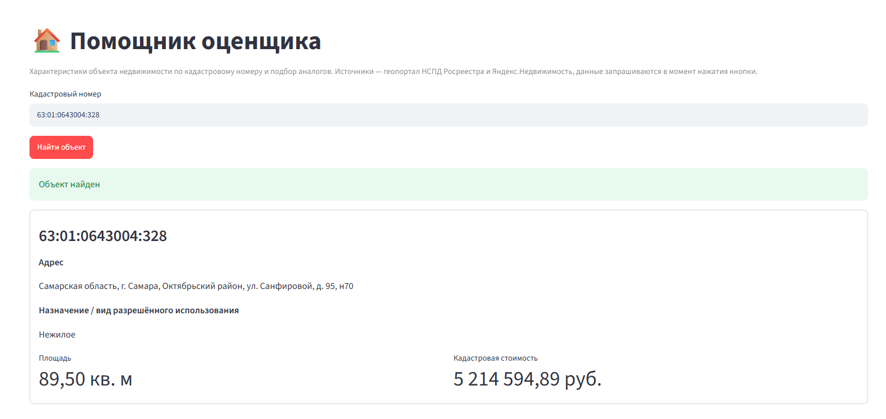
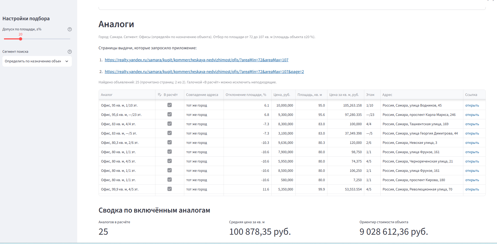
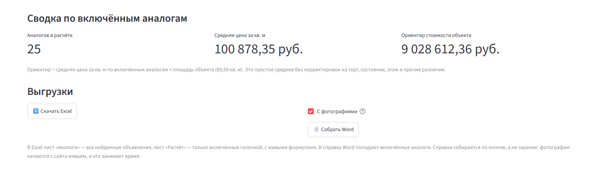
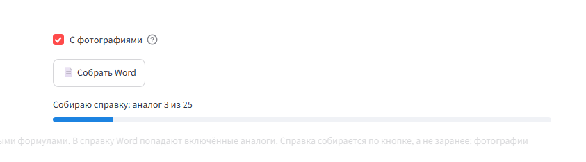

# Помощник оценщика

Настольное приложение для оценщика недвижимости. По кадастровому номеру
оценщик получает карточку объекта, подобранные по площади аналоги и ориентир
стоимости, а затем выгружает результат в книгу Excel с формулами и в справку
Word с фотографиями объявлений.

В приложении нет сохраненных данных и заготовленных ответов, поэтому при
каждом нажатии кнопки запрос отправляется в интернет заново.



## Объект и аналоги

Характеристики объекта загружаются с геопортала НСПД Росреестра, на котором
работает и Публичная кадастровая карта. На экран выводятся адрес, назначение,
площадь и кадастровая стоимость объекта.

Аналоги подбираются из текущей выдачи Яндекс.Недвижимости. Город и сегмент
рынка определяются по адресу и назначению объекта, а по площади аналоги
отбираются с допуском, который вы задаете ползунком в боковой панели. Найденные
объявления сортируются по тому, насколько их площадь близка к площади объекта.



Каждый аналог включается в расчет или исключается из него галочкой. По
отмеченным аналогам рассчитывается средняя цена квадратного метра, а по ней
ориентир стоимости объекта. Ориентир равен произведению средней цены на площадь
объекта, и корректировки на торг, состояние, этаж и прочие различия в нем не
учтены. Это отправная точка для расчета, и выдавать ориентир за результат
оценки или заменять им отчет об оценке нельзя.



## Как запустить

На Windows приложение запускается двойным щелчком по файлу
«zapustit_pomoshchnik_ocenshchika.bat». При первом запуске проверяется,
установлен ли Python, доустанавливаются нужные библиотеки, и приложение
открывается во вкладке браузера. Для этого файла можно создать ярлык на рабочем
столе и назначить ему значок znachok.ico.

Вручную приложение запускается из командной строки, открытой в его папке.

```bash
pip install -r requirements.txt
```

```bash
streamlit run app.py
```

Приложение откроется по адресу http://localhost:8501. Пока вы работаете, черное
окно командной строки закрывать нельзя, потому что программа выполняется в нем.

## Сетевые условия

Геопортал НСПД доступен только с российских адресов, поэтому через зарубежный
VPN соединение с ним не устанавливается и перед работой VPN нужно выключить.

Сертификат nspd.gov.ru выпущен российским удостоверяющим центром, которого нет
в списке доверенных у Windows и Python, поэтому для этого запроса проверка
сертификата отключена намеренно. Запрос к НСПД отправляется через библиотеку
curl_cffi в режиме браузера Chrome, потому что через обычную библиотеку requests
подключиться к сайту не удается.

## Выгрузки

По кнопке Excel выгружается книга из двух листов. На лист «Аналоги»
выгружаются все найденные объявления, а на лист «Расчет» выгружаются только
отмеченные галочкой. Расчет на этом листе построен на формулах, поэтому цены и
площади можно править прямо в Excel, и итог пересчитается.

По кнопке Word собирается справка с карточкой объекта, ссылками на страницы
выдачи и карточками отмеченных аналогов. Фотографии загружаются с сайта в
момент сборки, поэтому справка готовится дольше книги Excel.



Примеры готовых выгрузок сохранены в корне папки, это файлы
analogi_63-01-0643004-328.xlsx, analogi_77-07-0013002-4537.xlsx и
spravka_63-01-0643004-328.docx.

## Состав

Весь код собран в одном файле app.py. Разделы файла расположены в порядке
работы программы, от настроек запросов и вспомогательных функций к запросу
объекта в Росреестре, разбору адреса, запросу объявлений, выгрузкам в Excel и
Word и экрану приложения.

Приложение написано без ручного программирования, вайбкодингом.

## Промты сборки

Файл «Промты сборки — Помощник оценщика (для слушателей)» выложен в форматах
docx и pdf. В нем семь промтов, по которым вы собираете инструмент с нуля в
одном диалоге с моделью, а после каждого промта приведена проверка. Файлы
«Аналоги_и_расчёт.xlsx» и «Справка_по_аналогам.docx» содержат пример выгрузок
инструмента, собранного по этим промтам.

## Правовая рамка

Запросы к открытым источникам отправляются от имени пользователя, и в
приложении ничего не сохраняется. За использование сведений, полученных из НСПД
и Яндекс.Недвижимости, за проверку данных и за итоговые выводы отвечает
оценщик. Пользователь сам соблюдает условия использования этих сервисов.
